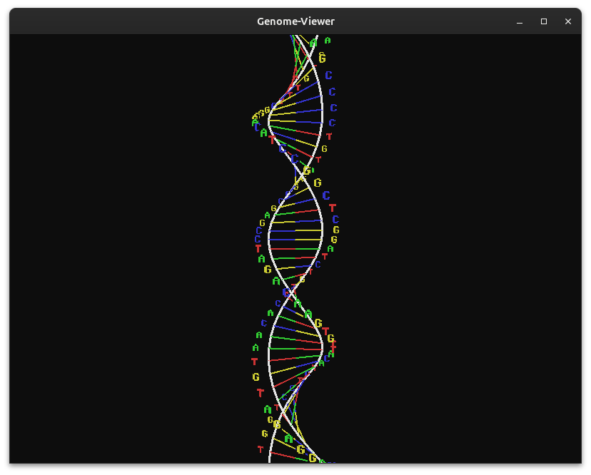

# genome-viewer

## requirements
```
sudo apt install libglfw3-dev libglew-dev libglm-dev
```

## build
```
cd genome-viewer
make
```

## download the Genome (or any FASTA file of your choosing):
```
cd genome-viewer
mkdir data
wget https://ftp.ncbi.nlm.nih.gov/genomes/all/GCF/000/001/405/GCF_000001405.40_GRCh38.p14/GCF_000001405.40_GRCh38.p14_cds_from_genomic.fna.gz
gunzip GCF_000001405.40_GRCh38.p14_cds_from_genomic.fna.gz
```

## Usage
```
cd genome-viewer
bin/gnome-viewer data/GCF_000001405.40_GRCh38.p14_cds_from_genomic.fna  
```

Keypress arrow Down/Up: Navigate through sequence records 
Keypress arrow Right/Left: Navigate through base pairs




